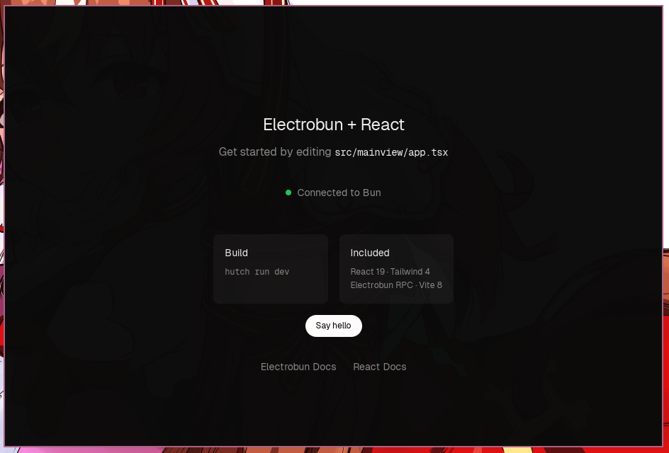

# Electrobun + React Template

A desktop application template built with **Electrobun 2.0** (Bun main process), **React 19**, **TypeScript**, **Tailwind CSS 4** and **Vite 8**.

The UI is a Vercel-style welcome screen that proves the stack works: it shows a live "Connected to Bun" badge backed by real RPC calls to the main process.

## Stack

| Layer    | Choice                                                                   |
| -------- | ------------------------------------------------------------------------ |
| Runtime  | Electrobun 2.0.x, main process on Bun                                    |
| UI       | React 19 renderered in a native webview                                  |
| Styling  | Tailwind CSS 4 (CSS-first config, `@theme` tokens)                       |
| Build    | Vite 8 (`@vitejs/plugin-react`, `@tailwindcss/vite`)                     |
| Language | TypeScript 7                                                             |
| RPC      | Typed `BrowserView`/`Electroview` schema shared between process and view |

## Quick start

Requirements: [hutch](https://framework.blackboard.sh/electrobun/guides/hutch/) (bundles the app, main process and devkit). Dependencies are resolved by hutch's built-in resolver; `node_modules` is managed through `bun.lock` / `hutch.lock`.

```bash
hutch run install   # install pinned toolchains and dependencies
hutch run dev       # build the view, then run the app in watch mode
hutch run dev:hmr   # Vite dev server (hot reload) + native window side by side
hutch run build     # production build (stable channel)
hutch run build:canary  # canary channel build
```

### Dev workflow

- `hutch run dev` rebuilds the view bundle and launches the window with `--watch`.
- `hutch run dev:hmr` runs Vite at `http://localhost:5173` and the app together (via `concurrently`). If Vite is detected, the webview loads from the dev server for hot reload; otherwise it falls back to the bundled `views://` assets (see `src/shared/helpers/hmr.ts`).

## Project structure

```
├── electrobun.config.ts        # app metadata + build config (mainProcess: bun)
├── hutch.config.ts             # hutch scripts (install/dev/start/build/…)
├── vite.config.ts              # view bundling, tsconfigPaths aliases
├── src/
│   ├── bun/                    # main process (Electrobun)
│   │   └── index.ts            #   creates the BrowserWindow, wires RPC
│   ├── mainview/               # the UI (webview)
│   │   ├── index.html          #   Vite HTML shell
│   │   ├── main.tsx            #   React entry (createRoot)
│   │   ├── app.tsx             #   root component (welcome screen)
│   │   ├── components/         #   RpcStatus badge, etc.
│   │   ├── lib/rpc.ts          #   webview-side RPC (Electroview.defineRPC)
│   │   └── styles/index.css    #   Tailwind + @theme tokens + Geist fonts
│   └── shared/                 # code shared by both process and view
│       ├── rpc/                #   shared AppRPC schema + handlers
│       ├── constants/vite.ts   #   dev server port/URL
│       └── helpers/            #   HMR resolution, Vite alias helper
```

## Typed RPC

The schema lives once in `src/shared/rpc/` and is imported by both sides:

- `types.ts` — the `AppRPC` contract (`bun.requests`, `webview.requests`/`messages`).
- `schemas.ts` — main-process handlers via `BrowserView.defineRPC` (`greet`, `status`).
- `src/bun/index.ts` passes the schema to `new BrowserWindow({ rpc })`.
- `src/mainview/lib/rpc.ts` defines the view half with `Electroview.defineRPC` and exposes `handlerRpc()`.

Call a bun request from React with `handlerRpc().status({})`. Add new endpoints by extending `AppRPC` in `types.ts` and the matching handler in `schemas.ts` — both sides stay type-safe.

## Notes

- `tsconfig.json` no longer extends the devkit config: TypeScript 7 removed `baseUrl` and requires explicit `types`, so the `electrobun/*` path mappings are declared inline.
- Iconography/typing: Geist and Geist Mono are loaded from a CDN in `styles/index.css`.
- Window size, title and identifier live in `src/bun/index.ts` and `electrobun.config.ts`.
- `hutch run install` uses `--frozen-lockfile`; commit `hutch.lock` and `bun.lock`.

## Docs

- [Electrobun](https://framework.blackboard.sh/electrobun/)
- [BrowserView / Typed RPC](https://framework.blackboard.sh/electrobun/apis/browser-view/)
- [Electroview (browser-side SDK)](https://framework.blackboard.sh/electrobun/apis/browser/electroview-class/)
- [React](https://react.dev/)

## Preview


